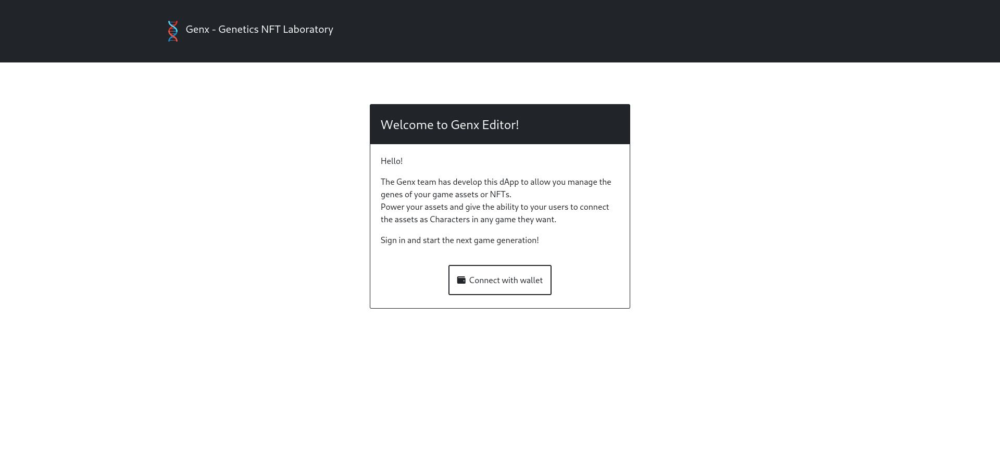
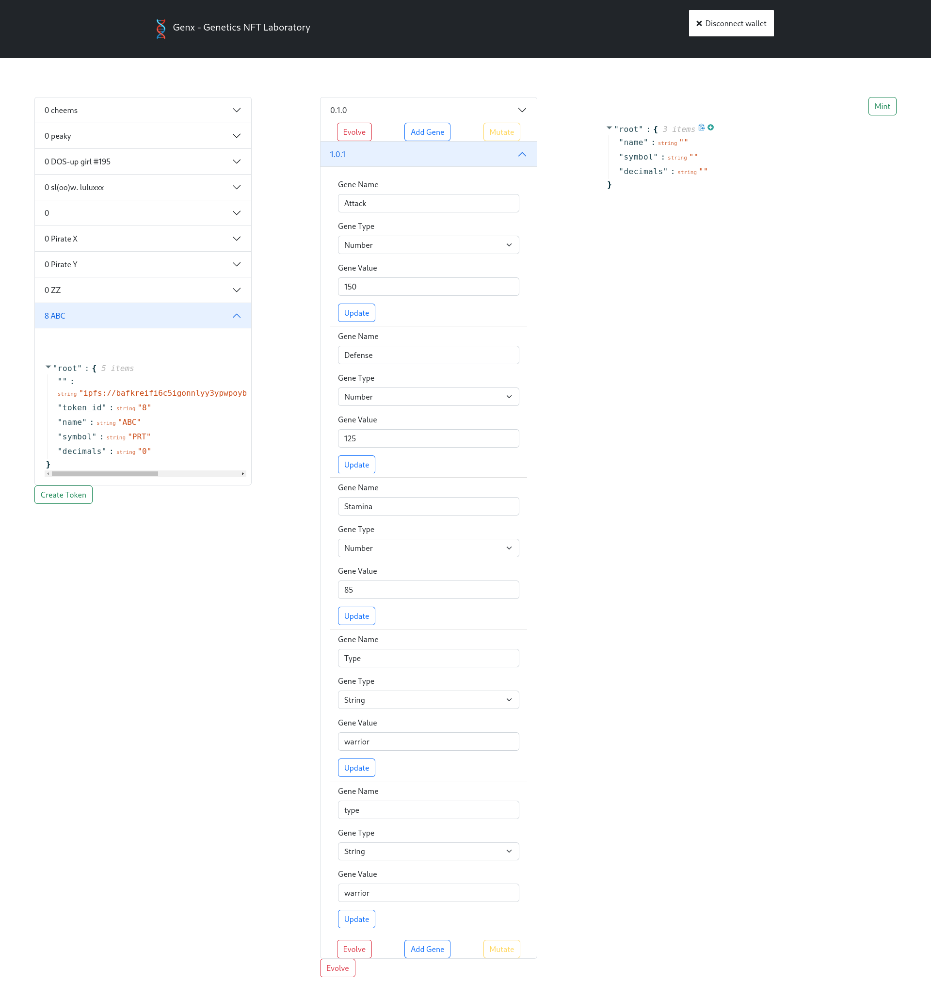

# GenX


[Website](https://genx.gordian.dev/) | [Contract](https://better-call.dev/ghostnet/KT1P2xiVEosLWqyUMyvjaRzK4NMbbwDEpX25) | [Demo Game](https://genx-game.gordian.dev/) | [Package](https://www.npmjs.com/package/@zoek/genx)


Empower your users adding genes to NFTS. 
Your users can mutate and evolve the assets in 
multiple games, don't tie the characters to only 
one game. Don't reinvent the wheel. Include
characters from other games that share the same stats,
Even you can evolve the character to include the required
genes by the game.

## Motivation

As a player, I wondered with games like Smash Bross where
many characters of different games joined in one sharing
the same mechanics.

Another motivator is Pokemon Home where you can share 
Pokemons among different Pokemon games, it impose certain
restrictions based on game generations, but with genx this is up to
Game designers.

To allow the game designers impose restrictions or 
get specific versions, the genx use the semver
to get the specified versions or merge all genes into one
(One for all).


## Structure
The Genx project provide the following components:
1. genx contract, every assets is also an FA2 token.
2. JS library to communicate with the contract.
3. Genx Editor, users can create NFT, Add genes, Mutate and Evolve visually.
4. Demo Phaser Game, to demonstrate how to retrieve the last token and use their genes.

## Deployed contract

Address: [KT1P2xiVEosLWqyUMyvjaRzK4NMbbwDEpX25](https://ghostnet.tzkt.io/KT1P2xiVEosLWqyUMyvjaRzK4NMbbwDEpX25)

BCD: [https://better-call.dev/ghostnet/KT1P2xiVEosLWqyUMyvjaRzK4NMbbwDEpX25/operations]()

## Installation

Install the JS library

```
yarn add @zoek1/genx
```

Setup demo game

```
cd client
yarn
```

Setup Genx Editor
```
cd app
# Enter vim and add the token to save metadata in IPFS
vim .env
# Add your web3.storage token
REACT_APP_WEB_STORAGE=<web3.storage>
yarn
```

## Usage
Open two terminals

```
cd app
yarn start
```

## Demo
https://www.loom.com/share/06679abb0fc141568c8435addf324b26

### Genx Editor



## Backlog

### Contract
- [X] As a contract user I can create one FA2 Token
- [X] As User I can transfer one token to another address
- [X] As Token owner I can add one Operator to the token.
- [X] As User I can add new Genes to one token
- [X] As User I can Patch one specific gene and upgrade it's patch version following semver logic.
- [X] As user I can Mutate one version and upgrade it's minor number following semver logic.
- [X] As user I can Evolve one token and make a major breaking change following semver logic.
- [X] As user I get the last genes from one contract view.
- [ ] As user when I evolve one genes I keep  a reference to the parent.
- [ ] As user I can bread based on two or more token genes using one strategy.
- [ ] As user I can fusion two genes.
- [ ] As user I can request a bread to one oracle using one strategy, the oracle should callback to the contract in the specified time with the new Token genes.
- [ ] As user I can link existing NFTs and add genes.


### Editor
- [X] As user I can create a token using a JSON editor to provide the properties
- [X] As user all properties are uploaded to IPFS Storage and assigned to the "" empty field using the canonical IPFS url.
- [X] As user I can evolve genes in the editor
- [X] As user I can Patch one field in the editor
- [X] As user I can mutate a set of genes in the editor
- [X] As user I can add new fields in the editor
- [X] As user I can delete one gene and generate one evolution
- [X] As user I get all my tokens 
- [ ] As user I have an assets uploader
- [ ] As user I see the token and its versions as images.

### Client Library
- [X] As developer I can create tokens
- [X] As developer I can create new genes for a token
- [X] As developer I connect with beacon wallet
- [X] As developer I can edit specific gene
- [X] As developer I can evolve a version
- [X] As developer I can mutate one token
- [X] As developer I get the last version of given token
- [X] As developer I get the list of versions of given token
- [X] As developer I get the specific version versions based on one  semver predicate
- [X] As developer I get all versions combined into one set of genes.
- [X] As developer I can fusion two set of genes
- [ ] As developer I can bread two or more set of gens

### Demo Game
- [X] As developer I Fetch the last token
- [X] As developer I create the stats based on the genes of the retrieves token
- [X] As gamer I select the character
- [ ] As gamer I select the weapon for the pirate
- [ ] As gamer I see a bot as adversary
- [ ] As gamer I can select my token and gene
